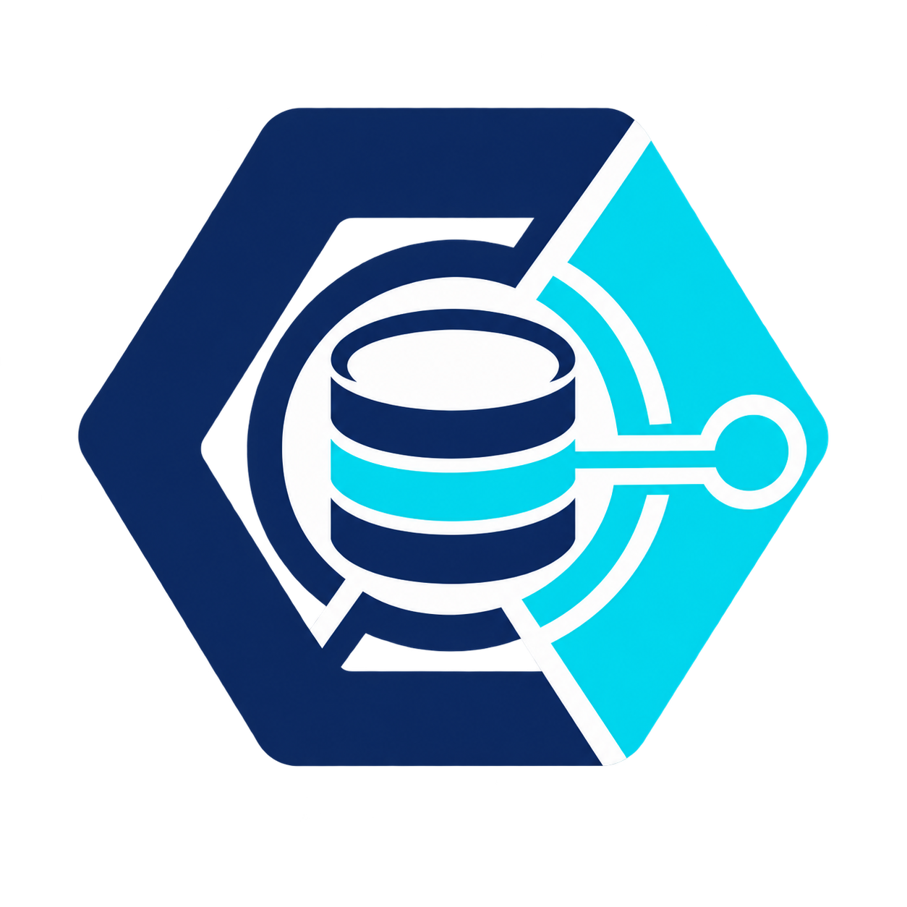

# Logali HANA Guard for n8n



`n8n-nodes-hana-secure` is a security-first n8n community node for governed reads from SAP HANA
Platform and SAP HANA Cloud. The package name stays descriptive and searchable; the node appears
in n8n as **Logali HANA Guard**.

> Status: `0.9.1` is the current public npm release with provenance and installs by name on
> self-hosted n8n. The direct connection, governed reads, table-function discovery, and
> parameterized ABAP CDS runtime recognition have been verified against SAP HANA `2.00.088` on a
> non-production system. The HANA Cloud / HDI onboarding, TLS gate, and schema fallback are
> unit-tested; an end-to-end test against a real HANA Cloud SQL endpoint remains pending.

## Why this node exists

Direct database access can be useful for reporting, reconciliation, data-quality checks, and
controlled integration scenarios. It also needs a stricter contract than a generic SQL text box.
Logali HANA Guard therefore makes structured read operations the default and places advanced SQL
behind an explicit credential-level switch.

This package:

- reads data only;
- binds filter values through prepared statements;
- validates and quotes schema, object, and column identifiers;
- supports credential-level schema, object, and column allowlists;
- can force object-specific filters that callers and AI agents cannot remove;
- supports typed filters, literal text matching, lists, ranges, and `AND`/`OR` logic;
- loads governed schema, object, and column choices in the n8n editor;
- reads exactly one row by a typed simple or composite key;
- supports stable composite-key keyset pagination, opaque continuation tokens, and bounded
  automatic page collection;
- recognizes SQL runtime views, calculation views, and virtual tables that may expose remote CDS
  runtime objects;
- discovers positional view parameters and named calculation-view placeholders, then binds their
  values through prepared statements;
- discovers, describes, and invokes governed HANA table functions with catalog-validated scalar
  inputs and prepared values;
- provides `Exists`, `Count`, `Distinct`, five-row `Preview`, and multiple aggregates per query;
- discovers primary and unique keys, reports database information, and exposes a sanitized active
  governance policy summary;
- returns each row as an item, all rows in one item, or enriches the incoming item;
- converts BIGINT, dates/timestamps, and binary values with explicit lossless output modes;
- reuses one HANA connection per node execution and returns safe query diagnostics;
- classifies and redacts database errors, including whether retry may be appropriate;
- enforces query timeouts plus hard row, page, and serialized-result limits;
- escapes catalog-name wildcards and supports a literal object-name prefix;
- enables TLS and certificate validation by default;
- keeps manually written SQL disabled by default;
- can be attached directly to an n8n AI Agent as **Logali HANA Guard Tool**;
- requires a separate credential opt-in for AI Tool use;
- blocks advanced SQL in the Tool variant even when normal workflows may use it;
- requires a separate opt-in before an AI Tool may discover catalog metadata;
- caps every Tool response by both rows and serialized bytes.

These controls are defense in depth. A least-privilege HANA user remains the primary security
boundary.

## HANA SQL or OData?

| Requirement                                             | Prefer direct HANA SQL                                           | Prefer OData / released SAP API                      |
| ------------------------------------------------------- | ---------------------------------------------------------------- | ---------------------------------------------------- |
| Reconciliation, diagnostics, private reporting          | Yes, through an approved view or exact read grant                | Also valid when the released API contains the fields |
| Read technical metadata or large analytical projections | Often                                                            | Sometimes                                            |
| Preserve SAP business validations and authorizations    | No                                                               | Yes                                                  |
| Create or change S/4 business documents                 | No                                                               | Yes                                                  |
| Write into an integration-owned staging or queue table  | Possible with a separate write credential and reviewed procedure | Optional                                             |

Never use generic `INSERT`, `UPDATE`, or `DELETE` against internal S/4 application tables. Basic
writes can be appropriate only for objects the integration owns, such as a staging table, queue,
or audited stored procedure. Business changes belong behind released OData APIs, BAPIs, CAP
services, or another SAP-supported transactional contract.

## Compatibility

- Self-hosted n8n only
- Node.js 22 or later
- SAP HANA Platform or SAP HANA Cloud with an accessible SQL endpoint
- TCP connectivity from the n8n host or container to the HANA SQL port

This is not an OData node. SAP HANA Cloud SQL endpoints normally use TLS over TCP port `443`, so
`443` is valid when it belongs to the HANA Cloud SQL endpoint. An arbitrary web/OData endpoint on
the same port is not interchangeable with a HANA SQL endpoint.

The node uses the Apache-2.0-licensed `hdb` driver maintained by SAP contributors. The driver is
bundled into the published artifact, so users do not need to install a native HANA client.
Version `2.27.1` is pinned because the `2.29.x` topology/physical-connection
rewrite stalled authentication through the tested NAT endpoint. Compatibility with newer driver
versions will be re-evaluated before a stable release.

## Installation

### Install from the n8n editor

On a self-hosted n8n instance, sign in as an Owner or Admin and open
**Settings → Community Nodes → Install**. Enter:

```text
n8n-nodes-hana-secure
```

Accept the community-node warning and select **Install**. Create or open a workflow and search for
**Logali HANA Guard**. To update later, return to **Settings → Community Nodes** and use the
package's **Update** action.

The instance must allow public community packages:

```text
N8N_COMMUNITY_PACKAGES_ENABLED=true
N8N_UNVERIFIED_PACKAGES_ENABLED=true
N8N_COMMUNITY_PACKAGES_PREVENT_LOADING=false
```

Persist `/home/node/.n8n` when n8n runs in Docker so the installed package survives container
recreation. In queue mode, ensure the package is available to the main process and every worker.

### Local development test

From this repository:

```bash
npm install
npm test
npm run lint
npm run build
```

Run `npm pack` to create an installable tarball for a non-production test before publishing.

### Install a test tarball in Docker

Copy the tarball to the Docker host and replace `<n8n-container>` with the development container
name:

```bash
docker cp n8n-nodes-hana-secure-0.9.1.tgz <n8n-container>:/tmp/

docker exec -u node -it <n8n-container> sh
mkdir -p /home/node/.n8n/nodes
cd /home/node/.n8n/nodes
npm install --omit=dev /tmp/n8n-nodes-hana-secure-0.9.1.tgz
exit

docker restart <n8n-container>
```

The `/home/node/.n8n` directory must be backed by a persistent volume. After the restart, refresh
n8n and search for **Logali HANA Guard**. Verify the installed version from the Docker host:

```bash
docker exec -u node <n8n-container> sh -lc \
  'cd /home/node/.n8n/nodes && npm ls n8n-nodes-hana-secure'
```

To uninstall the test tarball:

```bash
docker exec -u node <n8n-container> sh -lc \
  'cd /home/node/.n8n/nodes && npm uninstall n8n-nodes-hana-secure'
docker restart <n8n-container>
```

The direct SQL implementation requires TCP/TLS runtime capabilities and is intended for
self-hosted n8n. It is not currently available as a verified n8n Cloud node.

## Credential configuration

Create a **Logali HANA Guard API** credential with:

| Field                        | Purpose                                                                                          |
| ---------------------------- | ------------------------------------------------------------------------------------------------ |
| Connection Profile           | Direct HANA Platform connection or guided HANA Cloud / HDI setup                                 |
| Host                         | HANA SQL endpoint hostname or IP address                                                         |
| SQL Port                     | Tenant SQL endpoint port; SAP HANA Cloud normally uses TCP 443                                    |
| Database Name                | Optional tenant database name or HDI `database_id` when the SQL endpoint requires it              |
| Default Schema               | Optional fallback when a node leaves Schema empty; still checked against Allowed Schemas          |
| SAP Client                   | Optional three-digit ABAP client; sets both `CLIENT` and `CDS_CLIENT` for client-dependent CDS    |
| Ignore Server Topology       | Keeps NAT, forwarded, proxy, and managed endpoints on the configured host; enabled by default    |
| Username / Password          | Dedicated technical user; never use a broad administrator                                        |
| Use TLS                      | Encrypts the connection; mandatory for the HANA Cloud / HDI profile                              |
| Validate TLS Certificate     | Rejects untrusted certificates; mandatory for the HANA Cloud / HDI profile                       |
| Custom CA Certificate        | Optional PEM CA for a private certificate authority                                              |
| Allowed Schemas              | Optional comma-separated schema allowlist                                                        |
| Allowed Objects              | Optional comma- or line-separated exact `SCHEMA.OBJECT` allowlist                                |
| Column Policies JSON         | Optional map of each object to the only columns it may expose or use                             |
| Required Filters JSON        | Object-specific row predicates always enforced with `AND`                                        |
| Allow Advanced Read-Only SQL | Opt-in switch for trusted workflows; disabled by default                                         |
| Allow AI Tool Use            | Separate opt-in required before an AI Agent can call the Tool variant                            |
| Allow AI Catalog Discovery   | Separate opt-in for schema, object, and column discovery; disabled by default                    |
| AI Tool Row Limit            | Credential-level cap for each Tool call; 100 by default, maximum 1,000                           |
| AI Tool Result Size Limit    | Serialized response cap; 256 KiB by default, maximum 5 MiB                                       |
| Connection / Query Timeout   | Upper bounds for connection and query execution                                                  |

Use **Test** in the credential dialog, or the node's **Connection → Test Connection** operation.

For an HDI service key, choose **SAP HANA Cloud / HDI** and copy only its individual connection
values into the credential: SQL `host`, `port`, `user`, `password`, optional `database_id`, and
`schema` as **Default Schema**. Do not paste or retain the complete service-key JSON in n8n. This
profile fails closed unless both TLS and server-certificate validation are enabled. It changes
onboarding only: the same read-only operations, allowlists, prepared values, limits, and database
grants remain in force.

For NAT or port-forwarded laboratory endpoints, leave **Database Name** empty when the published
port already targets the tenant and keep **Ignore Server Topology** enabled. Pre-release `0.1.6`
was verified on SAP HANA `2.00.088` with connection metadata, schema listing, and a structured
read from `SYS.M_DATABASE`. The same test account could see that the `SAPHANADB` schema and its
tables existed but received `insufficient privilege` when it attempted to read `SAPHANADB.T001`.
That is the intended lesson: catalog visibility and network reachability do not grant access to
S/4 business rows.

### Governance policy example

Policies use exact, unquoted HANA identifiers. For example:

```json
{
	"allowedSchemas": "TRAINING",
	"allowedObjects": "TRAINING.GL_ITEMS,TRAINING.OPEN_ORDERS,TRAINING.GET_OPEN_ORDERS",
	"columnPoliciesJson": "{\"TRAINING.GL_ITEMS\":[\"MANDT\",\"COMPANY_CODE\",\"AMOUNT\",\"CURRENCY\"]}",
	"requiredFiltersJson": "{\"TRAINING.GL_ITEMS\":[{\"column\":\"MANDT\",\"operator\":\"eq\",\"value\":\"250\"}]}"
}
```

When a column policy exists, `Columns = *` expands to the approved projection. The same policy
also checks filter, sort, group, aggregate, and cursor columns. Required filters are parameterized
and cannot be weakened by choosing `OR`; the node groups user filters separately and joins the
credential filters with `AND`. A reusable sanitized file is available at
[`examples/hana-guard-governance-policy.example.json`](examples/hana-guard-governance-policy.example.json).
The credential test also rejects malformed JSON, policies outside the configured schema/object
allowlists, required filters on forbidden columns, and invalid AI result limits before connecting.

### Recommended database account

Ask the HANA administrator for a dedicated technical user or role with:

- connection permission;
- `SELECT` only on the specific views or tables required, plus `EXECUTE` only on approved table
  functions when they are used;
- no `INSERT`, `UPDATE`, `DELETE`, DDL, unrestricted procedure/function execution, user administration, or system
  administration privileges.

Exact grants depend on the HANA model and organizational policy. Do not copy a production business
user or database administrator account into n8n.

## Operations

### Connection

- **Test Connection**: returns the active user, schema, database, and TLS state.
- **Get Database Information**: returns the visible system ID, database name, version, usage, start
  time, and TLS state.

### Catalog

- **List Schemas**: lists visible non-system schemas and applies the credential allowlist.
- **List Tables and Views**: lists tables, SQL/calculation views, and virtual tables in one allowed
  schema, with an optional literal prefix and a result limit of 1–1,000 (100 by default).
- **List Table Functions / Parameterized CDS**: lists visible, valid table functions and generated
  parameterized ABAP CDS runtimes, prioritizing custom `Y*` and `Z*` names when a schema contains
  more than 500 functions. Results include input counts and SQL security mode and use the same
  exact object allowlist.
- **Describe Table Function / Parameterized CDS**: returns scalar inputs, output columns, SQL
  security mode, owner, determinism, and creation metadata without exposing implementation text.
- **Describe Table or View**: returns approved column metadata, including comments and defaults
  when the HANA catalog version exposes them.
- **Inspect Semantic/CDS Runtime View**: classifies SQL runtime views, calculation views, HANA
  virtual tables, and table functions that may represent a parameterized ABAP CDS runtime without
  claiming access to unavailable ABAP source definitions.
- **List Semantic View Parameters**: returns ordered SQL/virtual-view parameters, named
  calculation-view placeholders, or table-function inputs, including defaults and mandatory flags
  where HANA exposes them.
- **List Keys and Constraints**: discovers governed primary-key and unique-key columns.

Schema, object, filter-column, sort-column, cursor-column, aggregate-column, and key-column fields
load their choices from HANA. The choices apply the same schema, object, and column policies as
execution, so the editor does not advertise objects the credential is not allowed to use. When
**Default Schema** is configured, it appears first in the schema list and is used only when the
node's Schema field is empty; an explicit node value always wins.

### Row

- **Select Rows**: choose governed columns, typed filters, sorting, a row limit, and optional
  composite-key pagination without writing SQL. Use **Automatic (Bounded)** to follow pages up to
  both row and page caps, or pass the opaque `nextCursor` token to **Continue From Cursor Token**.
  Cursor columns are always placed first in the deterministic sort order.
- **Get One by Key**: provide one or more typed equality fields for a simple or composite key. The
  operation returns at most one row and fails when an incomplete key matches multiple rows.
- **Aggregate Rows**: combine up to ten `COUNT`, `COUNT DISTINCT`, `SUM`, `AVG`, `MIN`, or `MAX`
  calculations, with optional grouping and filters.
- **Count Rows**, **Exists**, **Distinct Values**, and **Preview Rows** provide bounded structured
  alternatives for common checks without handwritten SQL.

For a parameterized runtime object, choose **Runtime View Parameters**:

- **Auto Detect (Recommended)** inspects the governed runtime object and chooses the appropriate
  positional, calculation-placeholder, or parameterless form;
- **Positional SQL / Virtual CDS View Parameters** builds `"SCHEMA"."VIEW"(?, ...)`;
- **Calculation View Placeholders** builds validated
  `PLACEHOLDER."$$P_NAME$$" => ?` bindings;
- **No Input Parameters** reads a normal table or view.

Node version `1.4` adds **Row Source → Table Function / Parameterized ABAP CDS**. Choose a valid
function, add every scalar input by its catalog name, and then use the normal Select, Preview,
Count, Exists, Distinct, Aggregate, key lookup, filters, output-column policy, required filters,
limits, and composite pagination controls over the returned table. Table/array inputs are
intentionally rejected in this guarded contract. For AI Tool execution, the function must be named
explicitly in **Allowed Objects**; an empty object allowlist is not accepted for discovery or
invocation.

The node executes the HANA object that actually exists at SQL runtime. It does not parse or execute
ABAP CDS DDL source. A non-parameterized CDS with a generated SQL view is read as a view. A
parameterized classic CDS is commonly generated as a HANA table function and is invoked through
the table-function source. A remotely exposed parameterized object can also appear as a configured
HANA virtual table. CDS view entities without an SQL-visible runtime object must be consumed
through a released OData/API or an ABAP-side contract.

### ABAP CDS laboratory example

[`examples/abap/ZI_N8N_COUNTRY_P.ddls.asddls`](examples/abap/ZI_N8N_COUNTRY_P.ddls.asddls) is a
small parameterized ABAP CDS training view over the public local API `I_Country`. It generates the
runtime HANA table function `ZN8NCOUNTRYP` and accepts `p_country` as its only input. The example
was created, syntax-checked, and activated through ADT on a non-production S/4HANA practice system.
Live HANA catalog discovery then identified `SAPHANADB.ZN8NCOUNTRYP` as a valid table function with
one input parameter.

To consume it through Logali HANA Guard, choose **Row Source → Table Function / Parameterized ABAP
CDS**, select `ZN8NCOUNTRYP`, bind `P_COUNTRY = DE`, and set **SAP Client** to the practice client
(`250` in this example). The credential configures both HANA session variables required by
client-dependent ABAP CDS runtimes. Direct HANA access still requires a
separately reviewed SQL endpoint and database grant to the generated runtime function; ABAP
authorization and ADT access do not create that HANA grant. The live least-privilege account
correctly reached this database privilege boundary until that explicit grant was reviewed. The SAP
client is execution context, not an authorization boundary, so database grants and governance
policies remain mandatory.

User filters support `AND` or `OR`, equality and comparison operators, `LIKE`/`NOT LIKE`, literal
contains/starts-with/ends-with matching, `IN`/`NOT IN` lists, `BETWEEN`, and null checks. Values
remain prepared-statement parameters; identifiers remain validated and quoted.

Node version `1.3+` provides three output modes plus explicit BIGINT, date/timestamp, and binary
conversion. Every execution also has a serialized-size cap:

- **Each Row as an Item** for normal n8n item-by-item processing;
- **All Rows in One Item** for a bounded array such as a report or AI context input;
- **Add Rows to Input Item** to preserve upstream context and enrich it under a chosen field.

### SQL (Advanced)

- **Execute Read-Only SQL**: executes one `SELECT` with positional `?` parameters.

The advanced operation rejects semicolons, comments, caller-provided `LIMIT`/`TOP`, and write,
administrative, procedure, and transaction keywords. The SQL field does not accept n8n
expressions. Parameter values are provided as a JSON array.

Example:

```sql
SELECT "COMPANY_CODE", "FISCAL_YEAR", "AMOUNT"
FROM "TRAINING"."GL_ITEMS"
WHERE "COMPANY_CODE" = ? AND "FISCAL_YEAR" = ?
```

```json
["1010", 2026]
```

The guard is not a substitute for database permissions. Enable advanced SQL only for trusted
workflow editors. In node v1.1+, advanced SQL refuses credentials that contain schema, object,
column, or required-filter policies: arbitrary SQL cannot reliably promise those structured
boundaries. Use structured Row operations, or a separate database account whose exact grants are
the only boundary for advanced reads.

## AI Agent Tool

Version `0.6.0+` lets n8n generate **Logali HANA Guard Tool** from the same node. Add it from an
AI Agent's **Tool** connector and configure one approved operation exactly as you would configure
the normal node.

Recommended pattern:

1. Use a HANA account with exact `SELECT` grants plus schema, object, column, and row policies.
2. Enable **Allow AI Tool Use** and set conservative row and byte limits in the credential.
3. Choose a structured Row operation such as **Select Rows**, **Get One by Key**, **Aggregate
   Rows**, **Count Rows**, **Distinct Values**, **Exists**, or **Preview Rows** in the Tool node.
4. Fix the schema, table/view, columns, sorting, and ordinary filters in the workflow.
5. Let the model supply only narrowly described filter values when needed; keep identifiers fixed.
6. Give the Tool a specific description that says what data it returns and when to call it.

The Tool variant supports Connection and structured Row operations. Catalog operations require
the additional **Allow AI Catalog Discovery** switch. **SQL (Advanced)** is rejected at runtime
for every AI Tool call, even if the same credential permits advanced SQL in a normal workflow.
Credential-level row and byte limits prevent a workflow editor, imported template, or unexpectedly
wide value from silently expanding the agent's database or context surface.

## Example workflows

[`examples/415_hana_secure_readonly.json`](examples/415_hana_secure_readonly.json) contains a
sanitized workflow with no credentials, hosts, user names, or internal identifiers. After import,
attach your own credential and replace the training schema and view names.

[`examples/hana-guard-demo-0.5.json`](examples/hana-guard-demo-0.5.json) demonstrates a composite
key lookup and input-item enrichment with node version `1.2`. It is sanitized and intentionally
contains no credential binding.

[`examples/hana-guard-complete-0.6.json`](examples/hana-guard-complete-0.6.json) demonstrates
semantic/CDS runtime inspection, parameter discovery, prepared positional parameters, and bounded
automatic composite pagination with node version `1.3`.

[`examples/hana-guard-table-function-0.7.json`](examples/hana-guard-table-function-0.7.json)
demonstrates function discovery, description, prepared named inputs, governed output columns, and
bounded composite pagination with node version `1.4`. The corresponding reviewed lab DDL template
is [`sql/setup_table_function_demo.sql`](sql/setup_table_function_demo.sql).

[`examples/hana-guard-cds-country-0.7.json`](examples/hana-guard-cds-country-0.7.json) demonstrates
recognition and governed invocation of the parameterized ABAP CDS runtime table function
`ZN8NCOUNTRYP`.

The webinar examples are also sanitized:

- [`examples/webinar_catalog_discovery.json`](examples/webinar_catalog_discovery.json) verifies
  the session and discovers visible schemas;
- [`examples/webinar_object_inventory.json`](examples/webinar_object_inventory.json) checks three
  pre-approved demo objects through `SYS.M_TABLES`, without reading business rows;
- [`examples/webinar_data_samples.json`](examples/webinar_data_samples.json) contains the bounded
  T001, VBAK, and ACDOCA reads to run only after the dedicated account receives reviewed grants.
- [`examples/webinar_hana_external_ai_agent.json`](examples/webinar_hana_external_ai_agent.json)
  attaches Logali HANA Guard directly to an AI Agent and combines its bounded HANA read with
  released OData and external evidence tools.

[`sql/setup_webinar_readonly.sql`](sql/setup_webinar_readonly.sql) is a reviewable lab template
for the exact role and object grants. It contains placeholders only and must be executed by the
object owner or an administrator with the required grant option.

## MCP pattern

Direct AI Tool support does not turn the node into a generic SQL agent. For MCP, continue to wrap
fixed sub-workflows behind n8n's **MCP Server Trigger** and publish narrow tools such as:

- `get_company_codes` — fixed object, fixed columns, fixed row limit;
- `get_recent_sales_orders` — approved projection and deterministic sorting;
- `get_ledger_sample` — fixed company/year filters and bounded output.

Do not publish a `run_sql` tool. The HANA credential, schema allowlist, node limits, sub-workflow
input schema, and MCP authentication are separate layers and should all remain in place.

## Development and release

The project was scaffolded with the official n8n node CLI. The build compiles the node and bundles
the pure-JavaScript HANA driver while leaving `n8n-workflow` external.

Before a release:

```bash
npm run lint
npm test
npm run build
npm pack --dry-run
```

See [CONTRIBUTING.md](CONTRIBUTING.md), [SECURITY.md](SECURITY.md), and
[CHANGELOG.md](CHANGELOG.md).

The public repository is
`https://github.com/Logali-Group/n8n-nodes-hana-secure`. npm Trusted Publishing is configured for
the public GitHub repository and `publish.yml`; version tags publish through short-lived OIDC
credentials with provenance instead of a long-lived npm token.

## License and trademarks

This project is licensed under the MIT License. See [LICENSE.md](LICENSE.md).

The bundled `hdb` driver is licensed under Apache License 2.0. See
[THIRD_PARTY_NOTICES.md](THIRD_PARTY_NOTICES.md).

SAP and SAP HANA are trademarks or registered trademarks of SAP SE in Germany and other countries.
This independent community project is not affiliated with, sponsored by, or endorsed by SAP SE or
n8n.
